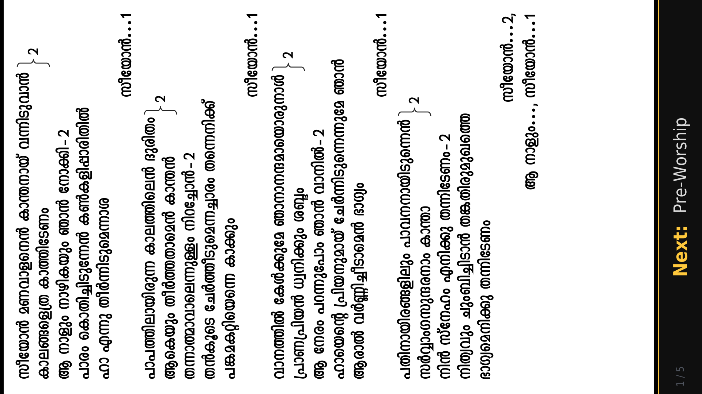
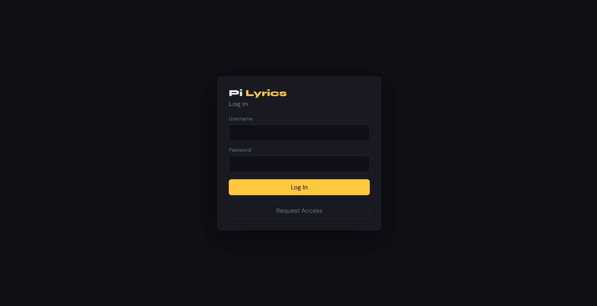
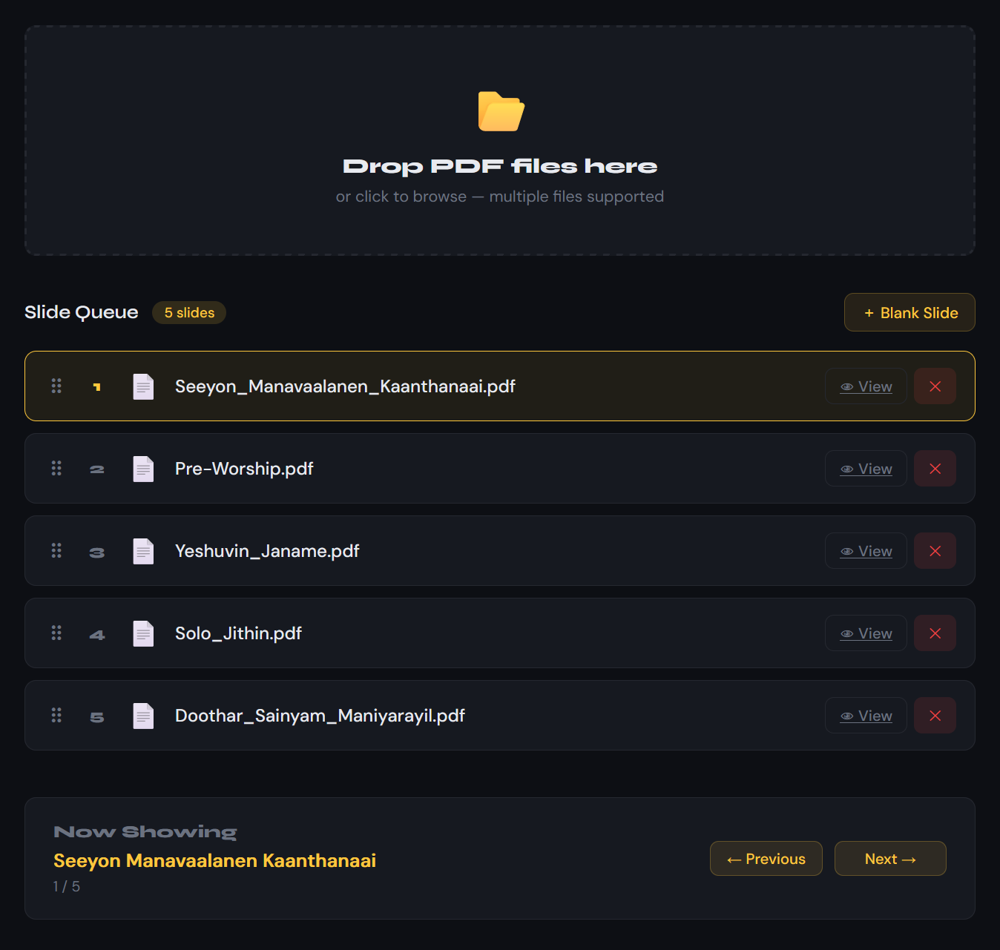

<h1 style="font-family:'Syne', sans-serif; font-weight:800;
  color:#fff;">Pi <span style="color:#ffc83d;">Lyrics</span></h1>

A web-based slide management system designed to run smoothly on Raspberry Pi devices like the Zero 2 W, with support for displaying PDF slides on vertical monitors. Ideal for church services, presentations, or any scenario requiring sequential lyric slide playback with remote control capabilities.

## Features

- **Web Interface**: Upload, reorder, rename, and delete PDF slides through a clean web UI
- **Blank Slides**: Insert custom blank slides with labels for transitions or breaks
- **Real-time Display**: Dedicated display application that shows slides on a rotated monitor
- **Remote Control**: Navigate slides via web interface or keyboard shortcuts on the display
- **Optional Authentication**: Secure login system with admin capabilities — or disable it for public access
- **File Management**: Automatic PDF page counting and multi-page support
- **Drag & Drop**: Intuitive reordering of slides via drag-and-drop
- **Responsive Design**: Works on desktop and mobile devices

## Installation

### Preferred install path

Use this installer from the project root on Raspberry Pi OS:
```bash
sudo bash install.sh
```

It will:
- install required system packages with `apt`
- create `~/pi-lyrics`
- copy `display.py` and `server.py` into that directory
- create a Python venv with `--system-site-packages`
- install `PyMuPDF` in the venv using a custom `TMPDIR`

### Why this is needed

The Pi install can fail in two common ways:
- `low disk space` errors while creating the venv
- `No module named fitz` after installing `python3-pymupdf` from apt

This project works reliably by installing `pymupdf==1.22.3` directly into the venv with a temporary disk-backed `TMPDIR`.

### Manual fallback

If you prefer to do the steps manually, use:
```bash
mkdir -p ~/tmp
TMPDIR=~/tmp python3 -m venv ~/pi-lyrics/venv --system-site-packages
TMPDIR=~/tmp ~/pi-lyrics/venv/bin/python -m pip install --break-system-packages --no-cache-dir "pymupdf==1.22.3"
```

### Optional autostart

Autostart is optional. If you do not want the display app to launch automatically on login, do not enable autostart.

To start the display manually after install:
```bash
bash start-display.sh
```

To enable optional autostart later:
```bash
bash enable-autostart.sh
```

Or use the equivalent manual autostart setup:
```bash
mkdir -p /home/pi/.config/autostart
cat > /home/pi/.config/autostart/pi-lyrics.desktop <<'EOF'
[Desktop Entry]
Type=Application
Name=Pi Lyrics
Exec=bash -c "sleep 20 && /home/pi/pi-lyrics/venv/bin/python /home/pi/pi-lyrics/display.py"
StartupNotify=false
EOF
```

This launches the display app after login with a short delay, giving X time to become available.

### Starting the app

Start the server from the app directory:
```bash
cd ~/pi-lyrics && python server.py
```

Start the display app manually on the Pi display:
```bash
bash start-display.sh
```

## Usage

### Starting the Server

Run the web server:
```bash
python server.py
```

The server runs on port 5000 by default. Access the web interface at `http://localhost:5000`.

### Starting the Display

Run the display application on the machine connected to your vertical monitor:
```bash
python display.py
```

The display will automatically connect to the server and show slides in fullscreen mode.



The rotated display layout is designed for vertical monitors and shows the next slide preview while rendering the current PDF in fullscreen.

### Web Interface

1. **Setup**: On first run, create an owner account and choose whether to enable login
2. **Login** (if enabled): Use your username and password to access the system

   

3. **Upload Slides**: Drag and drop PDF files or click to browse
4. **Reorder Slides**: Drag slides to change their order
5. **Insert Blank Slides**: Click "Blank Slide" to add labeled blank slides
6. **Control Display**: Use Previous/Next buttons to navigate slides remotely
7. **Rename Slides**: Click on any slide name to rename it

The dashboard combines upload, queue management, and display controls into a single unified interface.



### Keyboard Shortcuts (on Display)

- `→` / `↓` / `Space` — Next page/slide
- `←` / `↑` — Previous page/slide
- `PgDn` / `PgUp` — Also work for navigation

### Admin Panel

Access the admin panel at `http://localhost:5000/admin` (admin users only) to:

- **Manage Users**: Approve user requests, make users admin or regular users, and delete accounts
- **Configure Login**: Enable or disable the login system (owner only) — toggle between requiring authentication or allowing public access
- **Reset App**: Owner-only reset to factory state, removing all slides and user accounts while preserving the app files

The owner account is protected and cannot be deleted.

## Configuration

The application uses several configuration files:

- `order.json`: Stores the current slide order
- `state.json`: Tracks current display state
- `control.json`: Handles remote control commands
- `users.json`: User account data (encrypted)
- `secret.key`: Flask session secret
- `config.json`: Application settings (login system enabled/disabled)

All files are created automatically in the project directory.

### Login System Configuration

On first setup, you'll be prompted to choose whether to enable or disable the login system:

- **Login Enabled** (default): Users must authenticate with username and password. Admin panel accessible at `/admin`.
- **Login Disabled**: Anyone can access the app without authentication. All authentication UI is hidden.

To change this setting anytime, the owner can visit the Admin Panel at `http://localhost:5000/admin` and toggle the "Login System" setting. Disabling login preserves all existing user accounts for future re-enabling.

## API Reference

### Files Management

- `GET /api/files`: Get list of slides
- `POST /api/upload`: Upload new PDF files
- `POST /api/order`: Update slide order
- `DELETE /api/delete/<filename>`: Delete a slide
- `POST /api/rename`: Rename a slide
- `POST /api/blank`: Insert a blank slide

### Display Control

- `GET /api/status`: Get current display status
- `POST /api/control`: Send navigation commands (next/prev)

### Authentication

- `POST /login`: User login
- `POST /register`: Request account access
- `POST /logout`: User logout

## Troubleshooting

### Common Issues

1. **Display not connecting**: Ensure both server and display are running on the same network
2. **PDF not rendering**: Check that PyMuPDF is installed correctly
3. **Permission errors**: Ensure write permissions in the project directory

### Logs

Check the terminal output for error messages and debugging information.

## Development

### Project Structure

```
pi-lyrics/
├── server.py          # Flask web server
├── display.py         # Pygame display application
├── pdfs/              # Uploaded PDF files
├── order.json         # Slide order configuration
├── state.json         # Display state
├── control.json       # Remote control commands
├── users.json         # User accounts
├── config.json        # Application settings (login system)
└── secret.key         # Session secret
```

### Contributing

1. Fork the repository
2. Create a feature branch
3. Make your changes
4. Test thoroughly
5. Submit a pull request

## License

This project is licensed under the MIT License - see the LICENSE file for details.

## Support

For questions or issues, please check the troubleshooting section or create an issue in the repository.

> If you want to include visuals in the docs, save screenshots to `screenshots/` and reference them inline in the relevant sections.
